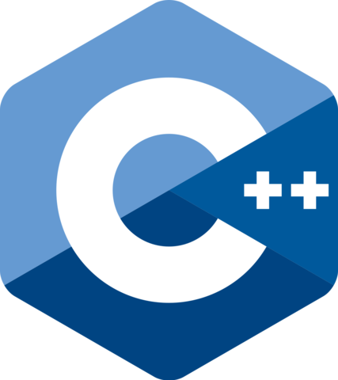

# Hi, I'm Alberto 🤑🤑

### About me:
I am a BS in Computer Science and Technology student at the Tecnológico de Monterrey University, with diverse knowledge in computer programming and application development. Adaptable to all work environments, with a strong sense of emotional intelligence and responsibility, willing to work as a team, always keeping in mind honesty, respect and tolerance. Eager to pursue a career in computer science with possibly a data science specialization.

### Areas of Interest:
Data Science, Web Development & Design, Data Bases, Videogame Development

### Domained Programming Languages & Tools:
               

# Dev-Stuff
Here's where I save all my most outstanding works, applications and codes as a developer during my B.S. in Computer Science career

---

## Projects
<table>
  <tr>
    <th>ID</th><th>Project Name</th><th>Language</th><th>Description</th>
  </tr>
  
  <tr>
    <td>1</td>
    <td><a href="https://github.com/4lb3rt0r/Dev-Stuff/tree/main/C%2B%2B/OOP">OOP</a></td>
    <td>
       C++
    </td><td>Here are contained the OOP scripts and algorithms elaborated in class, including the project.</td>
  </tr>
  
  <tr>
    <td>2</td>
    <td><a href="https://github.com/4lb3rt0r/Dev-Stuff/tree/main/C%2B%2B/Data%20Structure">Data Structures</a></td>
    <td>
       C++
    </td><td>Here are contained the Data Structure scripts and algorithms elaborated in class, including some final projects.</td>
  </tr>
  
  <tr>
    <td>3</td>
    <td><a href="https://github.com/4lb3rt0r/Dev-Stuff/tree/main/C%2B%2B/Advanced%20Algorithms">Advanced Algorithms</a></td>
    <td>
       C++
    </td><td>Here are contained the Advanced Algorithms scripts and structures elaborated in class, including some final projects</td>
  </tr>
  
  <tr>
    <td>4</td>
    <td><a href="https://github.com/4lb3rt0r/Dev-Stuff/tree/main/Python">Python programming</a></td>
    <td>
       Python
    </td><td>Here are contained some activities realized in Python language. Some of the scripts are made for classes, others are personal projects like using API's for manipulating other web applications, web scrapping, etc. There are missing scripts that have to be updated soon./td>
  </tr>
  
  <tr>
    <td>5</td>
    <td><a href="https://github.com/4lb3rt0r/Dev-Stuff/tree/main/DrRacket">Scheme Syntax Highlighter</a></td>
    <td>
       Racket
    </td><td>Here are contained some activities realized in Scheme/Racket for functional programming. As the project, I made a syntax highlighter that gives color to different C++ code components.</td>
  </tr>
  
  <tr>
    <td>6</td>
    <td><a href="https://github.com/DannyJr08/los-trabajos-de-steve_ssa-web.git">React Web/IOS Project</a></td>
    <td>
       React
    </td><td>I developed the website for a two-sided application, being a mobile app the complement, for a doctor member of the Public Health Secretary. The web part is intended to be designed and functional only for the doctor users.</td>
  </tr>
  
  <tr>
    <td>7</td>
    <td><a href="https://github.com/4lb3rt0r/Semana-Tec-Web.git">Vue3 Walmart WebPage</a></td>
    <td>
       Vue3
    </td><td>This project was made in one week and it's very simple. Basically, we had to make any web development project we wanted, so I chose to replicate a Walmart grocery webpage and it was coded in the Vue3 framework, so I could try more options than the conventional.</td>
  </tr>
  
  <tr>
    <td>8</td>
    <td>Django Predictive Models WebSite</td>
    <td>
       Django
    </td><td>This project is coded in Django framework. Basically, it is a webapp developed CEMEX that is used to implement neuronal networks as predictive models that can be used through the app based on the receieved epic input files, so the user can get an estimated data result of CEMEX quality products.</td>
  </tr>
  
  <tr>
    <td>9</td>
    <td><a href="https://github.com/4lb3rt0r/Dev-Stuff/tree/main/Unity">Unity Games</a></td>
    <td>
       Unity /  C#
    </td><td>Here are contained Unity game projects I've coded in C# for my classes and a few personal projects I've developed myself.</td>
  </tr>
  
  <tr>
    <td>10</td>
    <td><a href="https://github.com/4lb3rt0r/Dev-Stuff/tree/main/Erlang">Erlang Parallel Programming</a></td>
    <td>
       Erlang
    </td><td>Here are contained some activities and small projects realized in Erlang language for parallel programming.</td>
  </tr>
  
  <tr>
    <td>11</td>
    <td><a href="https://github.com/4lb3rt0r/Dev-Stuff/tree/main/Assembly">Assembly Project</a></td>
    <td>
      Assembly
    </td><td>This project involved implementing assembly code for a microprocessor used in the temperature regulation of car motors.</td>
  </tr>
  
  <tr>
    <td>12</td>
    <td><a href="https://github.com/4lb3rt0r/Dev-Stuff/tree/main/MATLAB">MATLAB modeling & programming</a></td>
    <td>
       MATLAB
    </td><td>Here are contained some activities realized in MATLAB for making matrix operations, 3D modeling or other coding excercises made during class.</td>
  </tr>
  
  <tr>
    <td>13</td>
    <td><a href="https://github.com/4lb3rt0r/Dev-Stuff/tree/main/R">R scripts</a></td>
    <td>
       R
    </td><td>Here are contained some activities realized in R language. Most of the scripts were coded during class, and the final projects where made for analyzing and comparing different COVID-19 variants and it's components.</td>
  </tr>
  
  <tr>
    <td>14</td>
    <td><a href="https://github.com/4lb3rt0r/Dev-Stuff/tree/main/SWI%20Prolog">SWI Prolog scripts</a></td>
    <td>
       SWI Prolog
    </td><td>Here are contained some activities realized in SWI PROLOG language. Most of the scripts were intended to be practice activities for the better understanding of logic and propositional programming.</td>
  </tr>
</table>
